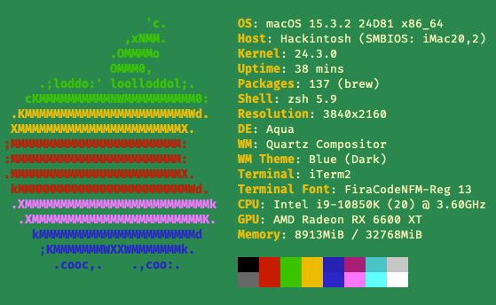

# Hardware

| Device | Details |
| --- | --- |
| Processor | i9-10850k |
| Motherboard | MSI MAG z490 Tomahawk |
| Memory | 2x16GB DDR4 3200 |
| Storage | WD_BLACK 1TB SN850X NVMe |
| GPU | ASUS Radeon RX 6600 XT 8GB |
| OpenCore | 0.9.5 |

Neofetch output:

System about dialog:

# Kexts

- Lilu
- VirtualSMC
- WhateverGreen
- AppleALC
- IntelMausi
- LucyRTL8125Ethernet
- NVMeFix
- RestrictEvents
- SMCProcessor
- SMCSuperIO
- USBToolBox
- UTBMap

# Notes

Start [here](https://dortania.github.io/OpenCore-Install-Guide/config.plist/comet-lake.html#starting-point)

[DSDT](DSDT.aml) extracted by SSDTTime.

- OpenCore Version: 0.9.5
- BIOS Version:  `E7C80IMS.1D0`
- BIOS Settings
  - Enable Resizeable BAR Support
  - Settings
    - Advanced
      - PCIe/PCI Sub-system Settings
        - Enable Above 4G Memory
        - Enable Re-Size BAR Support
        - Disable SR-IOV
      - Integrated Peripherals
        - Enable Intel LAN
        - Enable Realtek LAN
        - Enable HD Audio Controller
        - SATA Mode:  AHCI
      - Integrated Graphics Configuration
        - Enable IGD Multi-Monitor
        - Initiate Graphic Adapter:  `IGD`
        - Integrated Graphics Share Memory:  `64MB`
      - USB Configuration
        - Enable XHCI Hand-off
        - Enable Legacy USB Support *-- System won't boot from USB without this*
        - USB Port Control
          - All ports enabled
      - Power Management Setup
        - Disable ErP Ready
        - Disable System Power Fault Protection
        - Disable USB Standby Power at S4/S5
        - Restore after AC Power Loss: `Power off`
      - BIOS CSM/UEFI Mode:  `UEFI`
      - Disable DTM
      - Wake Up Event Setup
        - Wake Up Event By:  `BIOS`
        - Enable Resume By Onboard Intel LAN
        - Disable Resume By RTC Alarm
        - Disable Resume By PCI-E Device
        - Disable Resume By USB Device
        - Disable Resume From S3/S4/S5 by PS/2 Mouse
        - Disable Resume From S3/S4/S5 by PS/2 Keyboard
    - Boot
      - Enable Full Screen Logo Display
      - Disable GO2BIOS
      - Bootup NumLock State:  `On`
      - Info Block effect:  `Unlock`
      - Disable POST Beep
      - Disable MSI Fast Boot
      - Disable Fast Boot
    - Security
      - Disable U-Key
      - Trusted Computing
        - Disable Security Device Support
        - TPM Device Selection:  `fTPM 2.0`
        - Disable Disable Block Sid
      - Chassis Intrusion Configuration
        - Disable Chassis Intrusion
      - Secure Boot
        - Disable Secure Boot
        - Secure Boot Mode:  `Standard`
  - OC
    - CPU Features
      - Enable Virtualization
      - Disable CFG-Lock
      - Disable VT-d
      - Disable SGX

# USB Port Mapping

Info used for USBToolBox

[usb.json](usb.json)

**ASMedia USB 3.2 eXtensible Host Controller**
| Selected | Port # | Description | Type | Protocol | Companion | Name |
| --- | --- | --- | --- | --- | --- | --- |
| Yes | 01 | Back | USB-C | USB 3.0 | 02 | `BACK-USBC-3.0` |
| Yes | 02 | Back | USB-C | USB 2.0 | 01 | `BACK-USBC-2.0` |

**Intel USB 3.1 eXtensible Host Controller**
| Selected | Port # | Description | Type | Protocol | Companion | Name |
| --- | --- | --- | --- | --- | --- | --- |
| Yes | 01 | Back USB A above USB-C | USB A | USB 2.0 | 17 | `BACK-USBA-ABOVE-USBC-2.0` |
| | 02 | Unknown | | USB 2.0 | | |
| Yes | 03 | Left Front Panel | USB A | USB 2.0 | 19 | `FRONT-USBA-LEFT-2.0` |
| Yes | 04 | Right Front Panel | USB A | USB 2.0 | 20 | `FRONT-USBA-RIGHT-2.0` |
| Yes | 05 | Back USB A below Intel I219-V NIC | USB A | USB 2.0 | 21 | `BACK-USBA-1BELOW-I219V-2.0` |
| Yes | 06 | Back USB A below Intel I219-V NIC and port 05/21 | USB A | USB 2.0 | 22 | `BACK-USBA-2BELOW-I219V-2.0` |
| Yes | 07 | Back Keyboard/Mouse - Bottom | USB A | USB 2.0 |  | `BACK-USBA-TOP-KEY-2.0` |
| Yes | 08 | Back Keyboard/Mouse - Top | USB A | USB 2.0 | | `BACK-USBA-BOT-KEY-2.0` |
| | 09 | Back USB A below Realtek 2.5G NIC and port 10/26 | USB A | USB 2.0 | 25 | `BACK-USBA-2BELOW-RT2.5G-2.0` |
| | 10 | Back USB A below Realtek 2.5G NIC | USB A | USB 2.0 | 26 | `BACK-USBA-1BELOW-RT2.5G-2.0` |
| | 11 | USB 2.0 Hub (internal?) | | USB 2.0 | | `INT-2.0` |
| Yes | 12 | Mystic Light (internal? ARGB?) | | USB 2.0 | | `INT-MYSTICLIGHT-2.0` |
| Yes | 13 | Front Panel | USB-C | USB 2.0 | 18 | `FRONT-USBC-2.0` |
| | 14 | Unknown | | USB 2.0 | | |
| | 15 | Unknown | | USB 2.0 | | |
| | 16 | Unknown | | USB 2.0 | | |
| Yes | 17 | Back USB A above USB-C | USB A | USB 3.0 | 01 | `BACK-USBA-ABOVE-USBC-3.0` |
| Yes | 18 | Front Panel | USB-C | USB 3.0 | 13 | `FRONT-USBC-3.0` |
| Yes | 19 | Left Front Panel USB A | USB A | USB 3.0 | 03 | `FRONT-USBA-LEFT-3.0` |
| Yes | 20 | Right Front Panel USB A | USB A | USB 3.0 | 04 | `FRONT-USBA-RIGHT-3.0` |
| Yes | 21 | Back USB A below Intel I219-V NIC | USB A | USB 3.0 | 05 | `BACK-USBA-1BELOW-I219V-3.0` |
| Yes | 22 | Back USB A below Intel I219-V NIC and port 21 | USB A | USB 3.0 | 06 | `BACK-USBA-2BELOW-I219V-3.0` |
| | 23 | Unknown | | USB 3.0 | | |
| | 24 | Unknown | | USB 3.0 | | |
| | 25 | Back USB A below Realtek 2.5G NIC and port 26 | USB A | USB 3.0 | 09 | `BACK-USBA-2BELOW-RT2.5G-3.0` |
| | 26 | Back USB A below Realtek 2.5G NIC | USB A | USB 3.0 | 10 | `BACK-USBA-1BELOW-RT2.5G-3.0` |
